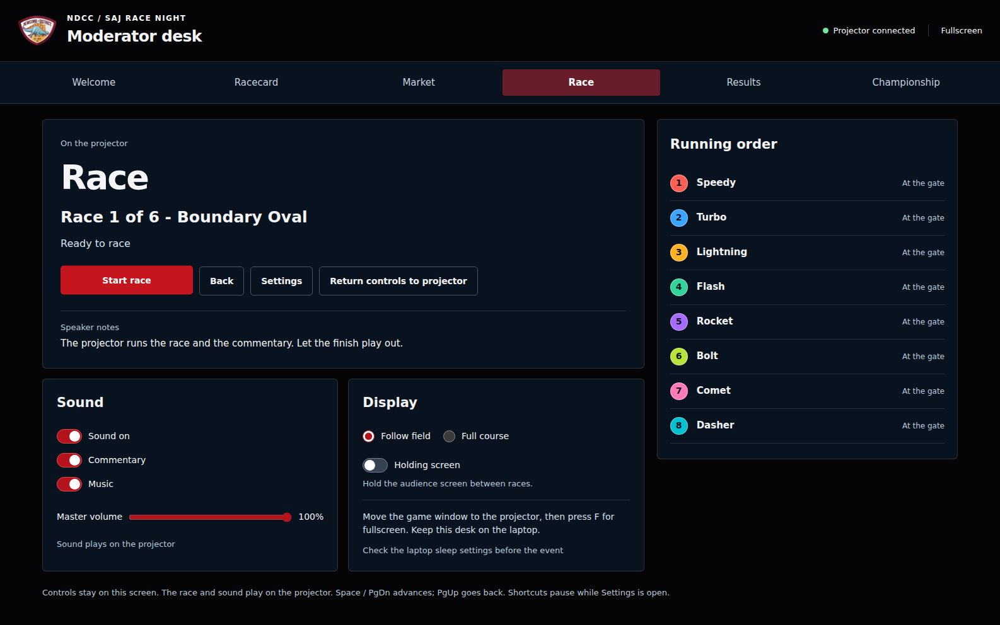
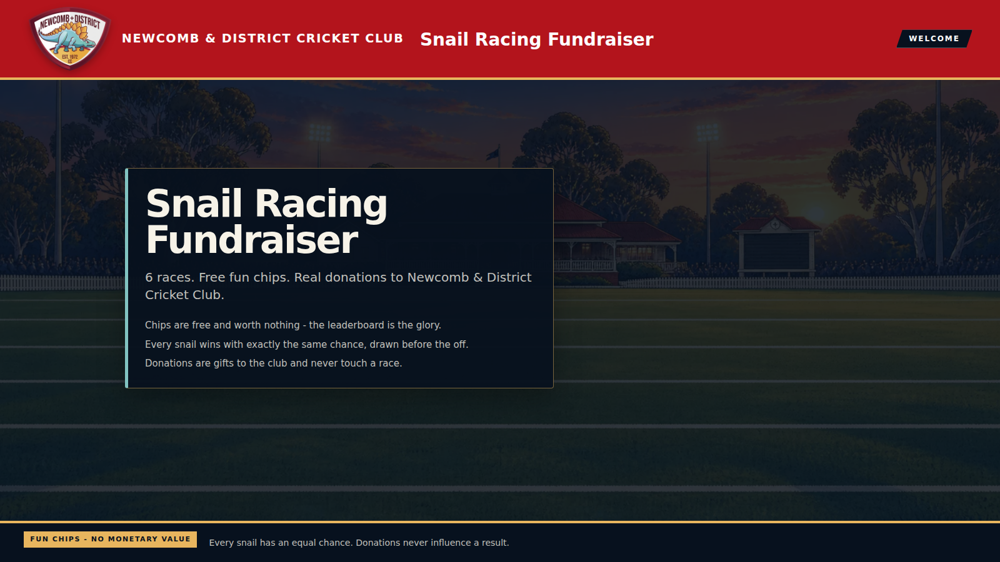
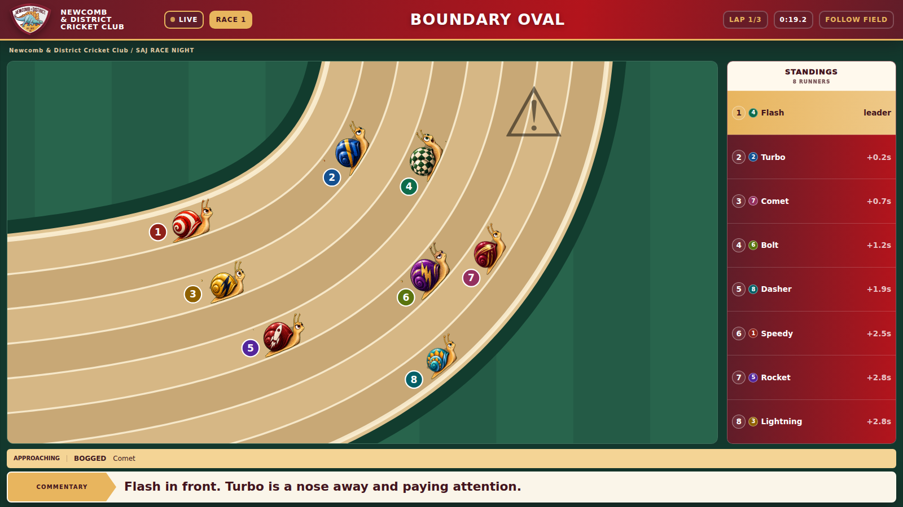

# Moderator desk and comeback races

## Run a show on two displays

1. Use the computer's **extended display** mode. Open Snail Race and select **Open moderator window**.
2. Keep the moderator desk on the laptop. Move the original game window onto the projector.
3. Click **Fullscreen** or press **F** in the game window. Move the pointer away from the top-right corner to hide the display buttons.
4. Use the desk's main button to introduce the field, open selections, lock the market and start the race. Settings, sound, camera, market timing and the running order stay on the laptop.
5. Use **Holding screen** between races for a branded break. Finish or void an active race before holding the show. **Return controls to projector** restores the original controls.

Space/PageDown advances and PageUp goes back. Settings suspends show shortcuts while editing. Escape closes a sheet or winner announcement; it never resets an active race. Fullscreen is requested in the game window because browsers require an interaction there. Window placement remains an operating-system action.

## A chase worth watching

With surprises enabled, races of at least six seconds include a comeback sequence. A lettuce ambush, sprinkler surprise or pitch roller can hold up the actual leader. A chasing runner then receives an NDCC crowd lift. Standard, Big night and Chaos include two sequences on races of at least 25 seconds; Calm and shorter races include one. Other course surprises fill the remaining gaps.

The director simulates the field before countdown to choose its targets. Delays and boosts change the eventual classification and are stored with the complete race plan, cues and hash. They never depend on selections, donations or operator actions. Each runner's total clock consequence stays within 16% of the planned duration. A delay stops a runner briefly rather than moving it off its lane or teleporting it backwards.

The existing course props, compact ticker and bundled recorded caller cover these moments. Spoken lines remain serialised; runner-specific detail appears in captions. Stored plans and the legacy all-finisher engine retain their existing playback path.

## One show, two windows

The moderator desk is a React portal into a native browser window. Only styles are copied. The game window continues to own the race clock, audio, media, Phone Play and settlement. Closing or refreshing the desk rebuilds controls around that same running show. Closing the game window closes its desk; the existing saved-plan recovery handles an interrupted start.

Recorded Race Pack controls also appear in the desk while video plays on the projector. The media must pass its existing fingerprint check before Play becomes available. Settings traps keyboard focus, and confirmations/downloads use the document containing their control.

## Verification and limits

Unit coverage checks deterministic plans, targeting the actual leader, overtaking, bounded consequences, surprise-off behaviour, immutable replay and first-finisher settlement. Browser coverage exercises both windows, fullscreen, camera/settings sync, blocked popups, refused fullscreen, desk reload/reopen, accidental shortcut prevention, real recorded-media playback, mobile layout and accessibility. Existing geometry, compact surprise, recorded commentary and Phone Play checks remain required release gates.

The visual review compares the generated desk concept with actual screenshots: hierarchy, NDCC identity, spacing, readable controls, and the separation between operator and audience content. The supplied club crest and truthful connection/audio states replace illustrative concept details.

Browser verification cannot establish compatibility with every physical projector, clicker or venue sound system. Fullscreen and screen wake lock depend on browser support and permissions. This release improves presentation and race drama; it does not certify commercial readiness or exact equivalence to Fundeo.
